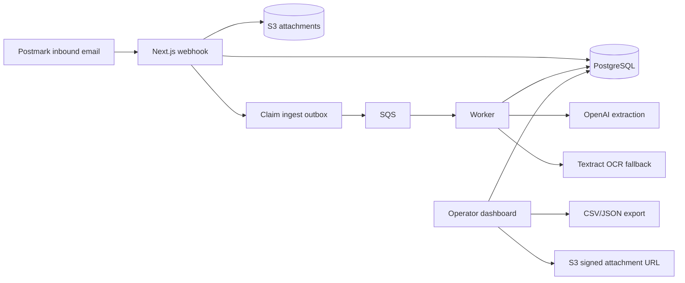

# ClaimFlow

ClaimFlow is a warranty-claim intake and review system.

It accepts inbound claim emails, stores attachments, runs automated extraction with OCR fallback, and gives operators a dashboard to review, correct, retry, recover, and export claims.

## Current Status

- V1 intake, extraction, dashboard, auth, export, and observability work is implemented.
- The repo also includes hardening beyond the original V1 plan:
  - same-origin checks for cookie-authenticated mutations
  - login and webhook rate limiting hooks
  - attachment count, size, type, and scanner guardrails
  - raw payload redaction and retention metadata
  - durable export and attachment-access audit events
  - DB-backed integration tests
  - browser e2e operator flows
  - full pipeline smoke tests
  - retryable `ERROR` claim recovery
  - stale `PROCESSING` detection and recovery
  - worker watchdog recovery
  - processing attempt and lease protections
  - machine-readable ops and health endpoints

## Repository Layout

```text
apps/
  web/       Next.js dashboard and API routes
  worker/    SQS worker and extraction pipeline
packages/
  db/        Prisma schema, migrations, seed, shared DB helpers
docs/
  runbooks/  Operational procedures
tests/       DB-backed route, workflow, and pipeline tests
e2e/         Playwright operator flows
scripts/     Local development helpers
```

## Core Flow

1. Postmark sends an inbound webhook to the web app.
2. The web app persists the inbound message, creates a claim, stores attachments to S3, and enqueues ingest work to SQS.
3. The worker consumes the queue message, runs extraction, optionally falls back to Textract, and persists extraction results.
4. The claim lands in `READY`, `REVIEW_REQUIRED`, or `ERROR`.
5. Operators review claims in the dashboard, export filtered data, retry retryable failures, and recover stale processing claims.

## Architecture



## Failure Modes Handled

- Duplicate Postmark deliveries are deduplicated by provider message ID.
- Queue dispatch uses an outbox and can defer failed sends for later dispatch.
- Worker processing uses processing attempts and lease tokens to avoid stale writes.
- Long SQS jobs can extend visibility while processing.
- Retryable worker failures can be retried manually; stale `PROCESSING` claims can be recovered manually or by the watchdog.
- Raw inbound payloads and raw model outputs carry retention metadata for redaction.
- Summary counters are backed by DB triggers and can be reconciled with an ops script.

## Prerequisites

- Node.js 22
- `pnpm` 9
- PostgreSQL 14+ or the repo-local cluster in `.postgres-data`
- AWS credentials and infrastructure for S3, SQS, and Textract if you want the full live pipeline
- Optional:
  - OpenAI API key for model extraction
  - Sentry DSN for error reporting

## Quick Start

1. Install dependencies:

```bash
pnpm install
```

2. Create local env config:

```bash
cp .env.example .env
```

3. Start the repo-local Postgres cluster if you use it:

```bash
pnpm db:local:start
```

4. Run migrations and seed data:

```bash
bash -lc 'set -a && source .env && set +a && pnpm db:migrate:deploy && pnpm db:seed'
```

If `CLAIMFLOW_SEED_ADMIN_PASSWORD` is blank, `pnpm db:seed` prints a generated admin password for that run.

5. Start the web app:

```bash
pnpm --filter @claimflow/web dev
```

6. Start the worker in a separate shell:

```bash
pnpm --filter @claimflow/worker dev
```

The web and worker package scripts automatically load the repo-root `.env` when present.

## Common Commands

- `pnpm lint`
- `pnpm typecheck`
- `pnpm build`
- `pnpm test`
- `pnpm test:smoke`
- `pnpm test:e2e`
- `pnpm ops:check-health`
- `pnpm ops:redact-expired-data`
- `pnpm ops:reconcile-summaries`
- `pnpm db:migrate:deploy`
- `pnpm db:seed`
- `pnpm db:local:start`
- `pnpm db:local:status`
- `pnpm db:local:restart`

Database-specific notes are in [packages/db/README.md](packages/db/README.md).

## Key Environment Variables

Use [.env.example](.env.example) as the source of truth. The most important settings are:

- `DATABASE_URL`
- `SESSION_SECRET`
- `CLAIMFLOW_SEED_ADMIN_EMAIL`
- `CLAIMFLOW_SEED_ADMIN_PASSWORD`
- `POSTMARK_WEBHOOK_BASIC_AUTH_USER`
- `POSTMARK_WEBHOOK_BASIC_AUTH_PASS`
- `POSTMARK_WEBHOOK_RATE_LIMIT_ATTEMPTS`
- `POSTMARK_MAX_ATTACHMENTS`
- `POSTMARK_MAX_ATTACHMENT_BYTES`
- `POSTMARK_MAX_TOTAL_ATTACHMENT_BYTES`
- `POSTMARK_ALLOWED_ATTACHMENT_TYPES`
- `POSTMARK_DEFAULT_ORG_SLUG`
- `POSTMARK_ALLOW_DEFAULT_ORG_FALLBACK`
- `LOGIN_RATE_LIMIT_ATTEMPTS`
- `LOGIN_RATE_LIMIT_WINDOW_SECONDS`
- `CLAIMFLOW_RAW_DATA_RETENTION_DAYS`
- `CLAIMFLOW_ATTACHMENT_RETENTION_DAYS`
- `AWS_REGION`
- `ATTACHMENTS_S3_BUCKET`
- `CLAIMS_INGEST_QUEUE_URL`
- `CLAIMS_INGEST_DLQ_URL`
- `CLAIMS_QUEUE_VISIBILITY_TIMEOUT_SECONDS`
- `CLAIMS_QUEUE_VISIBILITY_EXTENSION_INTERVAL_MS`
- `CLAIMS_PROCESSING_STALE_MINUTES`
- `CLAIMS_PROCESSING_WATCHDOG_ENABLED`
- `CLAIMS_PROCESSING_WATCHDOG_INTERVAL_MS`
- `CLAIMS_PROCESSING_WATCHDOG_BATCH_SIZE`
- `CLAIMS_PROCESSING_WATCHDOG_CONCURRENCY`
- `OPENAI_API_KEY`
- `CLAIMS_ALLOW_HEURISTIC_FALLBACK`
- `SENTRY_DSN`
- `CLAIMS_HEALTH_BEARER_TOKEN`
- `CLAIMS_HEALTH_MAX_STALE_PROCESSING_COUNT`

## Production Hardening Checklist

- Put login and webhook rate limiting behind shared Redis/KV or edge/WAF storage in multi-instance deployments.
- Replace the default clean attachment scanner hook with malware scanning before storing production attachments.
- Run `pnpm ops:redact-expired-data` on a schedule and pair attachment row deletion marks with S3 lifecycle expiration.
- Run `pnpm ops:reconcile-summaries -- --dry-run` from monitoring or scheduled operations, and reconcile drift with `pnpm ops:reconcile-summaries`.
- Review the CSP in `apps/web/next.config.ts` before tightening `script-src` for a production hosting target.
- Keep `POSTMARK_ALLOW_DEFAULT_ORG_FALLBACK=false` outside local development.

## Operational Endpoints

- `GET /api/claims/operations`
  - authenticated admin snapshot for claim operations
- `GET /api/ops/claims/health`
  - bearer-token protected health endpoint for monitors and uptime probes

## Key Docs

- [IMPLEMENTATION_PLAN_V1.md](IMPLEMENTATION_PLAN_V1.md)
- [docs/runbooks/monitor-claims-health.md](docs/runbooks/monitor-claims-health.md)
- [docs/runbooks/retry-claims-from-dlq.md](docs/runbooks/retry-claims-from-dlq.md)
- [packages/db/README.md](packages/db/README.md)

## CI

GitHub Actions includes:

- `CI` on push to `main` and pull requests, running `pnpm lint`, `pnpm typecheck`, `pnpm test`, and `pnpm build`
- `Claims Health` on a 10-minute schedule and manual dispatch when `CLAIMS_HEALTHCHECK_URL` and `CLAIMS_HEALTH_BEARER_TOKEN` repo secrets are configured
